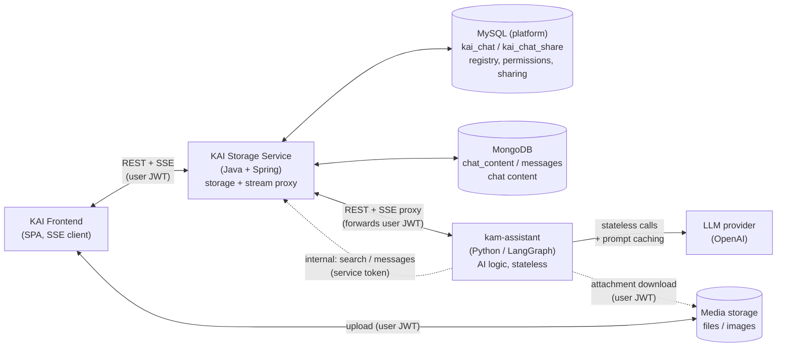
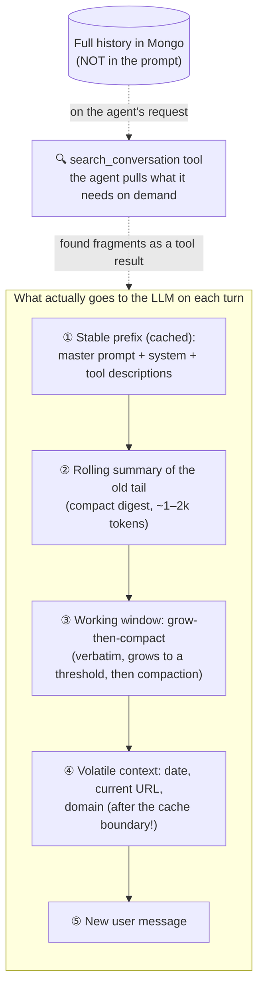
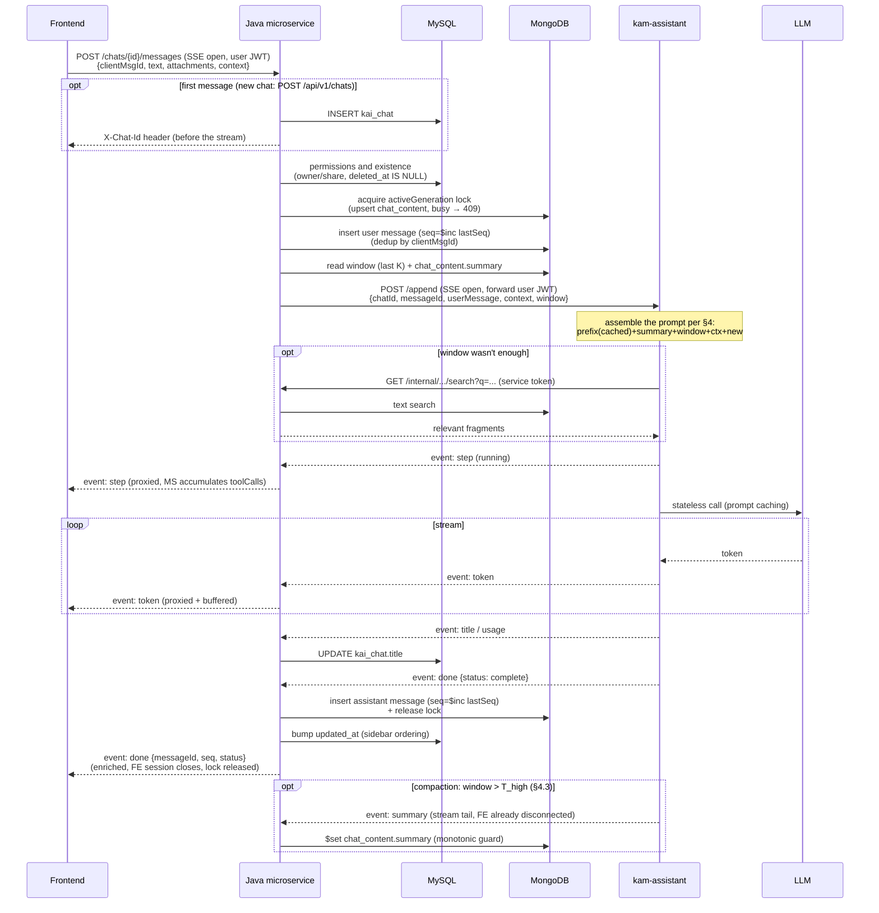
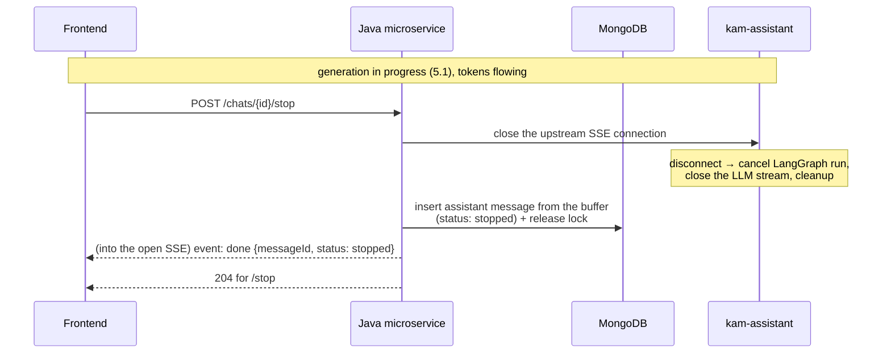
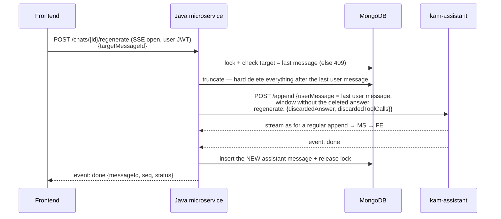

# KAI Chat — Interaction between Frontend ↔ Java Microservice (MySQL + Mongo) ↔ kam-assistant

> Complements and in places refines [`kai_chat_hld_EN.md`](kai_chat_hld_EN.md).
> This document describes **how the frontend, the new storage service (Java + Spring, MySQL + MongoDB), and kam-assistant (Python/LLM) interact**, and separately — **how to manage the LLM context as a chat grows**.

---

## 0. TL;DR — key decisions

| Topic | Decision |
|---|---|
| Microservice stack | **Java + Spring Boot, MySQL (registry) + MongoDB (content)**, modeled on `ms-pbx-prompt-storage` (a thin service: storage + stream proxy, **no AI logic, no LLM access**). The SSE proxy and JPA/MySQL are absent from the reference — these are new parts, see §3.5, §2.6. |
| Storage | **MySQL (shared platform DB)** — chat registry: ownership (`customer_id`/`account_id`), sharing, title. **MongoDB** — content: messages, summary, contexts. Linked by `chatId`; both DBs are accessed only through the Java MS (§2). |
| Python state | **Stateless** between requests. LangGraph SQLite checkpoints **stop being a store**; everything needed for generation arrives in the request or is fetched from the MS. |
| LLM context | **Stateless API + prompt caching + grow-then-compact window + summarization.** Plus a **history search tool** (agentic retrieval), so the whole chat never has to be stuffed into the prompt. |
| Who writes to the DB | **Only the microservice** (to both databases). Python never writes to the DB. |
| What history stores | Messages — only `user` and `assistant`. Tool calls — in the assistant message's `toolCalls` (some tools are mutations, a trace is required). **The `toolCalls` format is not final (§10.2):** we lean towards "READ — no output, WRITE — at least the created entity's ID" (§2.3, §3.3). |
| Who assembles the LLM context | **Python.** The microservice serves raw messages (pagination) + stores the summary as an "opaque" blob computed by Python. |
| Authorization | The MS **forwards the user JWT** to Python (the agent tools need it). Python→MS internal — service token (§3.4). |
| Stop generation | Supported from Lot1: explicit `POST /stop`, cancellation in Python via upstream-stream disconnect (§5.2). |

### Important reality-check disclaimer (diverges from the HLD draft)

The HLD draft (section "Python behavior on append/regenerate") assumes Python holds a `provider_session_id` and, when the session is valid, **"sends only the new message to the existing ChatGPT session"**. **The current code has none of this.** kam-assistant today:

- stores history in LangGraph checkpoints (`AsyncSqliteSaver`, keyed by `thread_id`) — see [`memory/sqlite.py`](src/kam_assistant/memory/sqlite.py);
- on **every** call accumulates all `messages` in the graph state and **sends them to the LLM in full** — see [`agents/no_automation_api_agent/nodes.py`](src/kam_assistant/agents/no_automation_api_agent/nodes.py).

From Python's point of view the provider (OpenAI) is **stateless**. The `append`/`regenerate` endpoints do **not** exist yet — there are `/stream`, `/invoke`, `/history` (see [`service/service.py`](src/kam_assistant/service/service.py)).

**Consequence.** With a stateless LLM API, "not sending the history every time" is physically impossible: the model remembers exactly what you sent in this request. "Cheap" is achieved not by refusing to send, but by:
1. **provider prompt caching** — the stable prompt prefix is cached on the provider side, so re-sending it is cheaper and faster;
2. **a window with compaction** — a bounded window goes into the prompt, the old tail is collapsed into a summary;
3. **agentic retrieval** — most of the history stays out of the prompt, and the agent **pulls what it needs via a tool** on demand.

Exactly this combination is laid out below (§4).

---

## 1. Components and responsibilities



| Component | Responsible for | NOT responsible for |
|---|---|---|
| **Frontend** | UI (ChatGPT-like), opening SSE to the microservice, rendering the stream **including step events** (agent steps), uploading files to media storage, collecting and sending the **Context**, the Stop button. | History business logic, talking to Python directly. |
| **Java microservice** | Chat registry in MySQL (ownership, sharing, title), content in Mongo (messages, summary), pagination, **SSE proxying** FE↔Python, **forwarding the user JWT** to Python, persisting messages "in final form", idempotency, **per-chat generation lock**, stop. | **Any AI logic.** Knows nothing about LLMs, tokens, prompts, summarization (it only stores the result). |
| **MySQL (platform)** | Chat registry: `kai_chat`, `kai_chat_share` — ownership (`customer_id`/`account_id`), sharing, title, soft delete. JOINs with platform tables. The authority on existence and permissions. | — |
| **MongoDB** | Chat content: messages, summary, contexts, operational generation fields. | — |
| **kam-assistant (Python)** | Context assembly, master prompt, domain injection, LLM calls, streaming of tokens and step events, summarization, chat title and quick-help pills generation, tools (GraphQL, docs, **history search**), downloading attachments from media storage, token diagnostics, **cancelling generation on disconnect**. | Storing history. Writing directly to the DB. |

> **Separation principle:** *the microservice is heavy on storage and thin on intelligence; Python is heavy on intelligence and stateless on storage.* The truth lives in the databases behind the MS (registry in MySQL, content in Mongo), so Python restarts and deploys never lose a single chat. Python currently runs as a single pod; if scaling is ever needed, this architecture does not block it.

---

## 2. Data model: MySQL (registry) + MongoDB (content)

Storage is split by the nature of the data:

- **MySQL (shared platform DB)** — the **chat registry**: who owns it, who it's shared with, what it's called. A relational store was chosen to JOIN directly with platform tables (accounts, users, etc.) — the chat list, permissions, and sharing queries are done in a single SQL query. The `kai_*` tables are owned by our MS (writes directly, its own migrations — Flyway/Liquibase).
- **MongoDB (separate database `kai_chat`)** — the **chat content**: messages, summary, contexts, operational generation fields.

Linked by `chatId`: the id is generated by the MS and is identical in both databases.

### 2.1. MySQL: `kai_chat` and `kai_chat_share`

```sql
CREATE TABLE kai_chat (
    id           CHAR(26)      PRIMARY KEY,   -- chatId, shared with Mongo
    customer_id  BIGINT        NOT NULL,      -- company (FK to a platform table)
    account_id   BIGINT        NOT NULL,      -- chat owner account (FK)
    title        VARCHAR(255),                -- generated by Python (event: title), written by MS
    created_at   TIMESTAMP     NOT NULL,
    updated_at   TIMESTAMP     NOT NULL,      -- bumped on every message → sidebar ordering
    deleted_at   TIMESTAMP     NULL,          -- soft delete
    INDEX idx_owner_chats (account_id, deleted_at, updated_at DESC),
    INDEX idx_customer (customer_id)
);

CREATE TABLE kai_chat_share (
    chat_id     CHAR(26)     NOT NULL,
    account_id  BIGINT       NOT NULL,        -- participant (Lot1: reader only)
    role        VARCHAR(16)  NOT NULL DEFAULT 'READER',
    created_at  TIMESTAMP    NOT NULL,
    PRIMARY KEY (chat_id, account_id),
    FOREIGN KEY (chat_id) REFERENCES kai_chat (id)
);
```

- **Owner model:** a customer = a company that has multiple accounts. The chat owner is `account_id`; a chat can be shared **only with accounts of the same `customer_id`** (checked in the service on `POST /share`) — this also satisfies the HLD requirement "share only with users visible on the users page".
- The sidebar chat list is a single MySQL query: own chats (`account_id = ? AND deleted_at IS NULL`) + shared ones (JOIN `kai_chat_share`), ordered by `updated_at DESC`.
- **Soft delete** (`deleted_at`): MySQL is the authority on chat existence. Mongo content is purged asynchronously (§2.5).

### 2.2. MongoDB: the `chat_content` document (chat operational data)

```jsonc
{
  "_id": "chat_abc123",            // = kai_chat.id
  "summary": {                     // blob OPAQUE to the MS, computed by Python
    "text": "User is analyzing experiment 294684; key findings so far: ...",
    "coversUpToSeq": 42,           // the summary covers messages up to and including seq=42
    "tokenEstimate": 850,
    "updatedAt": "2026-06-09T10:00:00Z"
  },
  "lastSeq": 45,                   // monotonic seq counter (only grows, $inc)
  "activeGeneration": null         // per-chat lock: { messageId, startedAt } while generating
}
```

- The document is created **lazily** — by an upsert on the first append.
- **`lastSeq`** — the source of `seq` for new messages: `findOneAndUpdate` with `$inc` atomically issues the next number. It never decreases (including on message deletion) — so gaps in `seq` are allowed and normal.
- **`activeGeneration`** — the "generation in progress" lock (see §9): acquired atomically — by the same `findOneAndUpdate` upsert that lazily creates the document; released on `done`/`stop`/error. A stuck lock is taken over based on the age of `startedAt`.
- Updates are **atomic `$set`s on specific fields**, never whole-document saves. Therefore optimistic locking (`version`/`lockVersion`/ETag from the reference) is **not needed** — see §2.6.

### 2.3. MongoDB: the `messages` collection

```jsonc
{
  "_id": "msg_000045",
  "chatId": "chat_abc123",         // reference to the chat
  "seq": 45,                       // monotonic sequence number within the chat
  "role": "user",                  // ONLY user | assistant (see below)
  "content": "Now summarize it briefly",
  "attachments": [                 // references to media storage, not the files themselves
    { "type": "image", "ref": "media://img-2", "name": "chart.png" }
  ],
  "toolCalls": [                   // assistant only; format NOT final — §10.2
    { "tool": "mcp.create_goal", "args": { "name": "High intent", "type": "CUSTOM" },
      "status": "success", "at": "2026-06-09T10:05:30Z",
      "result": { "id": 4521 } }   // draft: for WRITE — at least the created ID; READ has no output
  ],
  "context": {                     // Context as of the MOMENT of the message
    "domain_type": "experiment",
    "domain_id": "294684"
  },
  "status": "complete",            // assistant: complete | stopped | interrupted | error; user — always complete
  "tokenUsage": {                  // diagnostics (filled in for assistant)
    "input": 5120, "cachedInput": 4800, "output": 210
  },
  "clientMsgId": "fe-uuid-xyz",    // idempotency key from the frontend (user messages only)
  "createdAt": "2026-06-09T10:05:00Z"
}
```

#### Decision: roles are only `user`/`assistant`; tool results are not stored, tool calls are

**Tool results** (GraphQL query responses, docs excerpts) and internal planner/query-gen LLM messages are **not persisted**: results go stale — storing them would force the agent on subsequent turns to rely on outdated experiment data. By not storing them we force it to **re-query fresh data**; the price is latency and tokens for repeated queries. During generation the steps are visible to the frontend via stream `step` events (§3.3).

**Tool calls are persisted** — the `toolCalls` field on the assistant message: tool name, arguments, status, time. The fact of persisting is mandatory from Lot1, because the agent's tools **don't just read**: even today kam-assistant can create segments via GraphQL, and with MCP tools connected there will be more mutations. **What exactly to store is not a final decision (§10.2):** we lean towards splitting by operation type — for READ calls (queries) we don't store the output (it goes stale, see above); for WRITE calls (create/update) we store at least the identifiers from the response (the created segment's ID, etc.). The trace is needed for:
- **audit** — what the assistant actually did on the user's behalf;
- **regenerate without duplicates** — the agent sees the segment is already created and doesn't execute the mutation again (§5.3);
- **query dedup** — the planner sees which queries have already been run.

The MS aggregates `toolCalls` from the stream's `step` events and writes them together with the assistant message on `done`/`stop`. After a page reload the FE can show the calls (from `toolCalls`), but not their results.

#### Statuses

| `status` | When |
|---|---|
| `complete` | Normal completion (`done` from Python). |
| `stopped` | The user pressed Stop — a partial answer is saved (§5.2). |
| `interrupted` | The Python/LLM stream broke due to an infrastructure error — a partial answer is saved. |
| `error` | Generation failed before the first token. **TODO:** check the FE error-handling design (a stub message in history vs only a toast/retry without a record); if the design doesn't define it — a question for the PMs (§10.1). |

### 2.4. Indexes (MongoDB)

| Index | Purpose |
|---|---|
| `{ chatId: 1, seq: 1 }` (unique) | Ordered pagination, ordering guarantee, anchor loading (for the future "shared message"). It is also the HLD's "sort by creation date": `seq` is monotonic in time. |
| `{ chatId: 1, clientMsgId: 1 }` (unique, sparse) | Idempotency: dedup of re-sends. |
| text index on `content` | History search for the tool (see §4.4). |

### 2.5. Storage notes and two-database consistency

- **Messages are stored "in final form", not by tokens** (an HLD requirement). Tokenization/windowing is Python's job, done on the fly.
- **TTL/retention:** unlike the current SQLite checkpoints, product history is **persistent** — no TTL.
- **`seq` matters more than `createdAt`** for anchor loading and ordering: the monotonic counter via `lastSeq` rules out time-based races. The HLD mentions a future "anchor for sharing message" — `seq` covers that with no rewrite.
- **Which Mongo exactly** (an HLD question): for content — a **separate `kai_chat` database** (possibly in a shared cluster, but logically isolated from the PBX `prompt_storage` and the history DB): different lifecycle, different permissions. The registry, meanwhile, is in the **shared platform MySQL**, precisely for JOINs with its tables.
- **MySQL↔Mongo consistency** (no cross-DB transactions):
  - **MySQL is the authority on existence and permissions.** Every operation starts with a registry check (owner/share, `deleted_at IS NULL`); the MS touches Mongo only after that.
  - **An empty chat is frontend-only state; it doesn't exist on the backend.** A chat comes into being together with its first message: a single append creates the MySQL row and the `chat_content` in Mongo. The window where "the MySQL row exists but Mongo content doesn't" is legal (the first generation is still running, or failed before the write).
  - **Chat deletion** = a soft delete in MySQL (the chat instantly becomes invisible everywhere) → asynchronous purge of Mongo (`messages`, `chat_content`) and media. Orphaned content during the purge window is unreachable — the registry has already hidden it.
  - `updated_at` in MySQL is bumped on `done` — sidebar ordering; a few seconds of skew is not critical.

### 2.6. Relation to the reference (`ms-pbx-prompt-storage`)

From the reference we take the **infrastructure**: Spring Data Mongo, Mongock migrations, package structure, two-tier JWT filters (optional/strict), GlobalExceptionHandler. **We do not take the data model** — the PBX fields (`variationObjIds`, `parentId`, `from`, `MessageType`, `version`/`lockVersion` + ETag) have no consumers in a chat. In particular, optimistic locking is not needed: the FE never does read-modify-write on documents — all MS writes are message appends and targeted `$set`s, and generation concurrency is handled by the `activeGeneration` lock (§2.2). **New relative to the reference** (factor into the Java squad's estimate): the SSE proxy (§3.5; Feign is not suitable for it) and JPA + MySQL migrations.

From the **HLD** the `append` wire format is reused — it became the basis of the MS→Python contract (§3.2).

---

## 3. API contracts

Two perimeters, as in the reference: **external** (FE, requires JWT) and **internal** (`/internal/...`, Python only, via service token).

### 3.1. Frontend ↔ Microservice (external)

| Method | Path | Purpose |
|---|---|---|
| `GET` | `/api/v1/chats` | Chat list (from the MySQL registry: own + shared; pagination, ordered by `updated_at`). |
| `POST` | `/api/v1/chats` | **Create a chat with its first message + SSE.** Body — same as append ⤵. There are no empty chats on the backend: a "new chat" before the first message exists only on the frontend. The `chatId` is generated by the MS and returned immediately in the `X-Chat-Id` header (before the stream — so the FE can update the URL and call `/stop`), and also in the enriched `done`. |
| `GET` | `/api/v1/chats/{chatId}` | Chat metadata (title, participants, …). |
| `GET` | `/api/v1/chats/{chatId}/messages` | **History pagination** (scroll rendering). The `fromSeq`/`toSeq`/`limit` parameters follow the same convention as the internal endpoint (§3.2): no parameters — the tail, `toSeq` — pages back while scrolling up, a range — anchor loading (future "shared message"). |
| `POST` | `/api/v1/chats/{chatId}/messages` | **Append + SSE.** Send a user message and receive the answer stream. ⤵ |
| `POST` | `/api/v1/chats/{chatId}/regenerate` | **Regenerate + SSE.** Regenerate the last answer. Body: `{targetMessageId}` (§5.3). |
| `POST` | `/api/v1/chats/{chatId}/stop` | **Stop the current generation** (§5.2). `204` if stopped, `404` if there is no generation. |
| `POST` | `/api/v1/pills` | Quick-help pills for the new-chat screen. Body: `{ context, locale }` — `locale` is mandatory: pills are generated before the first message, so there is nowhere else to get the user's language from (§6). Not chat-scoped — the chat doesn't exist on the backend at that moment. **Only for the "generated" variant — no decision yet, a PM question (§10.1).** With hardcoded FE pills the endpoint is not needed at all. |
| `GET` | `/api/v1/tools` | MCP tool catalog for display in the UI. The MS caches it from ms-mcp-server (§3.6). |
| `POST` | `/api/v1/chats/{chatId}/share` | Share a chat (Lot1: reader-only; only with accounts of the same customer). |
| `DELETE` | `/api/v1/chats/{chatId}` | Delete a chat. |

**`POST /messages` request (append):**
```jsonc
{
  "clientMsgId": "fe-uuid-xyz",        // idempotency key (mandatory)
  "text": "Now summarize it briefly",
  "attachments": [ { "type": "image", "ref": "media://img-2" } ],
  "context": {                          // see §6 — Context format
    "domain_type": "experiment",
    "domain_id": "294684"
  }
}
```
**Response:** `Content-Type: text/event-stream` — an SSE stream (event format in §3.3).

> **Note for the FE:** SSE over `POST` means the native `EventSource` won't work — read via `fetch` + `ReadableStream` (the standard approach of all chat UIs). No out-of-the-box auto-reconnect/`Last-Event-ID`; recovery after a drop goes through `GET /messages` (the MS finishes writing the answer to the DB even if the frontend drops, see §5.2).

### 3.2. Microservice ↔ kam-assistant (internal)

Python receives **only what is needed for generation** and decides itself what to send to the LLM. The history is **not passed in full** by default — a bounded "tail" + summary arrives, and Python fetches the rest via a tool.

| Method | Path (Python side) | Purpose |
|---|---|---|
| `POST` | `/append` | Generate an answer. SSE outward (to the MS). **Requires the user JWT** (forwarded by the MS). Also covers regenerate — via the `regenerate` block (§5.3); there is no separate endpoint. |
| `POST` | `/pills` | Generate quick-help pills. Body: `{ context, locale }`. |

> **Cancelling generation:** Python has no separate cancel endpoint. The cancellation signal = **the MS closing the SSE connection** (see §5.2). Python must handle the disconnect correctly: cancel the LangGraph run (`asyncio` cancellation), close the stream to the LLM provider, release resources.

| Method | Path (MS side, **internal**) | Purpose |
|---|---|---|
| `GET` | `/internal/chats/{chatId}/search?q=...&limit=10` | **History search** for the agent tool (§4.4). Matches are returned with their `seq`. |
| `GET` | `/internal/chats/{chatId}/messages` | Flexible history retrieval, parameters below ⤵. There is no separate "window" endpoint: the MS always inlines the generation window into `/append`. |

**`GET /internal/.../messages` parameters** — all optional, none mandatory:

| Parameter | Semantics |
|---|---|
| `fromSeq` | Lower bound by `seq`, inclusive. |
| `toSeq` | Upper bound by `seq`, inclusive. |
| `limit` | Maximum number of messages (default 20 — matches the `/append` window size). If the range is wider than the limit, the messages closest to `toSeq` are returned. |

Examples: **no parameters** — the last `limit` messages (the chat tail); `?toSeq=44` — a history page back from seq 44; `?fromSeq=20&toSeq=30` — an exact range, e.g. the context around a `search_conversation` hit.

> The range is defined by `seq`, not by positions ("0th through 10th", negative indices from the end): `seq` has gaps (regenerate), positional indices over gaps are ambiguous, and all anchors in the system (search, anchor loading) already operate on `seq`. The "last N" case is covered by the no-parameters default.

**`POST /append` request (MS → Python):**
```jsonc
// Headers:
//   Authorization: Bearer <user JWT>   ← forwarded from the FE as is (§3.4)
{
  "chatId": "chat_abc123",
  "messageId": "msg_000045",            // user message id (already assigned by the MS)
  "userMessage": {
    "text": "Now summarize it briefly",
    "attachments": [ { "type": "image", "ref": "media://img-2" } ]
  },
  "context": { "domain_type": "experiment", "domain_id": "294684" },

  // INLINE optimization: the MS includes the working window + summary right away,
  // so that in the typical case Python does NOT have to make a callback.
  "window": {
    "summary": { "text": "...", "coversUpToSeq": 42 },
    "recentMessages": [ /* history STRICTLY BEFORE userMessage (it is not here), each has a seq */ ],
    "moreBefore": true                  // is there history older than the window (fetch via tool)
  },
  "regenerate": null                    // on regeneration: { discardedAnswer, discardedToolCalls } (§5.3)
}
```

> **Why this shape (a pull/push hybrid):** the MS can cheaply "return the last N + summary" (a pure storage read, no AI). So it **inlines the window** into `/append` — removing an extra round trip in the typical flow. The decision "how much exactly to send to the LLM / when to summarize / what to search" stays **in Python**. If the window isn't enough, Python fetches more via `/internal/.../search` or `/messages`. The window size the MS sends is a config (initially ~20 messages); Python can always request more.

### 3.3. SSE event format (the same on both hops)

The microservice proxies the Python stream to the frontend, intercepting control events for persistence.

```
event: token        data: {"content":"Here"}              // tokens of the final answer
event: token        data: {"content":" is"}
event: step         data: {"id":"s1","tool":"graphql_query","args":{...},"label":"Querying experiment results","status":"running"}
event: step         data: {"id":"s1","tool":"graphql_query","args":{...},"label":"Querying experiment results","status":"done"}
event: title        data: {"title":"Experiment 294684 summary"}
event: usage        data: {"input":5120,"cachedInput":4800,"output":210}
event: error        data: {"message":"..."}
event: done         data: {"status":"complete"}           // end of the ANSWER
event: summary      data: {"text":"...","coversUpToSeq":44}   // tail AFTER done — seen only by the MS (§4.3)
```

| Event | Does the MS persist it? | Does the MS proxy it to the FE? | Purpose |
|---|---|---|---|
| `token` | buffered → into the assistant message's `content` | ✅ | Answer text. |
| `step` | ✅ aggregated into `messages.toolCalls` (§2.3; format not final — §10.2) | ✅ | Agent steps for the "thinking/querying" UI. |
| `title` | ✅ → MySQL `kai_chat.title` | ✅ (refresh the sidebar) | Chat title (Python generates it on the first append). |
| `summary` | ✅ → `chat_content.summary` (monotonic guard on `coversUpToSeq`) | ❌ (arrives after `done`, the FE is already disconnected) | Compaction tail (§4.3). |
| `usage` | ✅ → `messages.tokenUsage` (aggregated over all LLM calls of the turn) | optional | Token/credits diagnostics. |
| `error` | ✅ → `status: interrupted/error` | ✅ | Generation error. |
| `done` | insert the assistant message, **release the lock, close the FE session** | ✅ **enriched** | See below. |

**Enriching `done`:** Python does not assign IDs — the MS does. On receiving `done`, the MS inserts the assistant message into Mongo and **rebuilds the event** before sending it to the frontend:

```
event: done   data: {"messageId":"msg_000046","seq":46,"status":"complete"}
```

After sending `done` the microservice closes the **FE session** and releases the `activeGeneration` lock — the user can immediately send the next message. **The upstream session with Python may live longer**: `event: summary` arrives after `done` (compaction is computed after the answer, §4.3); the MS writes it to Mongo and closes the upstream when Python closes the stream. This refines the HLD requirement "closes both sessions": both are closed, just not necessarily simultaneously.

### 3.4. Authorization (end to end)

```
FE ──(user JWT)──► MS ──(same user JWT, forwarded)──► Python ──(user JWT)──► GraphQL API / media storage
                                                Python ──(service token)──► MS /internal/*
```

- **FE → MS:** user JWT, same as FE → Python today. The MS validates it (OIDC/JWKS, the pattern from the reference), extracts `accountId`/`customerId`, and checks permissions against the MySQL registry (owner or share).
- **MS → Python:** the MS **forwards the original user JWT** in the `Authorization` header. This is mandatory: the agent tools (the GraphQL tool) call the Kameleoon API **on the user's behalf** — today the token is placed into a request-scoped context (`set_access_token` in [`service/service.py`](src/kam_assistant/service/service.py)) and used by the tool. Python's mechanics don't change — only the caller does.
- **Python → media storage:** the same user JWT when downloading attachments (§7).
- **Python → MS `/internal/*`:** a service token (or mTLS) — mechanism to be chosen (§10). Internal-perimeter requests are trusted: the MS does not mix them with user permissions.
- ⚠️ **Edge:** a long generation + the JWT expires mid-stream → the GraphQL tool gets a 401. Handled as a tool error (the agent informs the user), not as a stream failure. Normally the token TTL ≫ generation time.

### 3.5. SSE proxy in Java: this is net-new, the reference won't help

`ms-pbx-prompt-storage` is **synchronous** Spring Web + Feign; there is no streaming there at all. For the KAI microservice, SSE proxying is a new part:

- **Feign won't do** for SSE (it buffers the response). The upstream call to Python needs a streaming client: `java.net.http.HttpClient` (`BodyHandlers.ofLines`) or Spring `WebClient`.
- Server model choice: **(a) servlet + virtual threads** (`SseEmitter`, Java 21+; the reference already enables `spring.threads.virtual.enabled=true`) — the recommended option: we stay in the model familiar from the reference, and virtual threads remove the "one thread per hanging connection" problem; **(b) WebFlux** — a reactive stack, more powerful for streaming, but a different code style across the whole service.
- Proxy requirements regardless of the choice: line-by-line relaying without buffering the whole response; heartbeat/comment events to keep the proxy chain alive; idle timeouts on both hops; guaranteed closure of **both** sessions and release of the `activeGeneration` lock in a `finally`; continuing to read the upstream if the FE drops (§5.2).

### 3.6. MCP tool catalog (ms-mcp-server)

The agent's tools live in **ms-mcp-server**; kam-assistant connects to it and loads the catalog at startup. The frontend needs the list for the UI (displaying available tools) — and the FE gets it **from the MS, not from Python**:

```
FE ──GET /api/v1/tools──► MS ──(cache, TTL)──► GET http://ms-mcp-server:8080/internal/mcp/tools
kam-assistant ──MCP connect (catalog loading + tool execution)──► ms-mcp-server
```

- The MS here is a simple caching proxy for a directory: it's a data read, not AI logic, and it preserves the "FE has one front door" principle (Python stays fully internal, §3.4). We do **not** build a separate FE-facing tools-list endpoint in kam-assistant.
- Python talks to ms-mcp-server **independently** — connecting and executing tools, as today (catalog loaded at startup).
- If **filtering tools by agent/domain** is ever needed — that is AI configuration and must not live in the MS: either a static config or metadata served by Python.

**Slash commands.** `/tool-name arguments…` is **plain text** for the FE and the MS — the contracts don't change (the FE merely builds the slash-menu autocomplete from the `GET /api/v1/tools` catalog); in history the command is stored as user text, so the window/regenerate/search all work unchanged. **Python** interprets the command: it detects the `/` prefix, resolves the name against the MCP catalog, and makes an LLM call with a **forced tool choice** (`tool_choice` with the specific function) — determinism of the choice is guaranteed by the API, the model only extracts the arguments from the text. The arguments are validated against the tool's JSON schema: invalid/missing → we don't execute, the model asks a clarifying question. An unknown command → normal agent mode. Mutating commands are subject to the confirmation policy (§10.1).

---

## 4. LLM context management strategy (the core of this document)

Goal: with a chat of any length (3 messages or 300), **don't inflate the prompt and don't pay for the whole tail again**, while preserving answer quality.



### 4.1. Layer 1 — Prompt caching: what it actually buys

- The prompt is built so that the **longest possible stable prefix** comes first: `master prompt → system instructions → tool descriptions → summary → message window`. The more stable the prefix between calls, the higher the cache hit rate.
- **OpenAI mechanics:** prompt caching is automatic — for requests with a stable prefix ≥1024 tokens, the cached part of the input is billed at a discount. No code changes needed; only the "stable first" ordering matters. The cache is short-lived: evicted after ~5–10 minutes of inactivity (at most about an hour).
- **An honest assessment of the cross-turn cache.** A human replies in minutes — the short-lived cache will often **miss** between turns. So the cache is NOT the economic foundation for long chats (that is the window + summary, §4.2–4.3) but an accelerator. Where the cache pays off guaranteed: **within a single turn**. Our agent makes **several LLM calls per user question** (entry point → planner → query gen → query check → answer), and they all share the prefix — within a turn the cache hits nearly 100%, regardless of the user's pace.

### 4.2. Layer 2 — Message window: grow-then-compact, not sliding

How exactly to send old messages is the main efficiency question. Two options:

**Anti-pattern — a "sliding window of the last N".** Each turn the oldest message falls out of the window → **the beginning of the history in the prompt changes every turn** → the cache misses on the entire message portion every time. We pay full price for the window on every turn; the cache only works for the system prefix.

**Correct — grow-then-compact (how ChatGPT and similar assistants work):**

1. The window **only grows**: each turn appends messages at the end; nothing falls out. The prompt between turns is the same prefix + tail → the history hits the cache in full (within the TTL).
2. When the window exceeds the **upper threshold** `T_high` (initially ~16k tokens), Python cuts the oldest part down to the **lower threshold** `T_low` (~6–8k) **in one chunk**, folding the removed part into the summary. The `T_high − T_low` hysteresis guarantees compaction happens **rarely**, not on every turn.
3. The turn right after compaction is "expensive" (the summary changed → everything after it is invalidated in the cache). This is a rare and predictable event; afterwards the window grows and caches again.
4. `summary.coversUpToSeq` moves **in jumps** (by the size of the removed chunk), not one message at a time.

Rules:
- Budget **in tokens, not message counts** (one message with a results table ≠ one "ok").
- The `T_high`/`T_low` thresholds are Python config, calibrated on real chats (§10).
- The MS knows nothing about this mechanic: it stores the summary blob and serves a "last N" window with a margin; the actual window boundary is decided by Python via `coversUpToSeq`.

### 4.3. Layer 3 — Summarization / compaction (the tail doesn't grow linearly)

- The **rolling summary** of the old part of the dialog lives in `chat_content.summary` (Mongo). It is **computed by Python** (a separate cheap LLM call at compaction time, §4.2), **stored by the microservice** (as a blob), delivered via the `event: summary` in the stream.
- The prompt gets `summary (②) + window (③)`, not the whole chat. Chat growth inflates not the prompt but the summary — and that only **boundedly** (each new compaction rewrites the summary rather than appending to it forever).
- Implementation in the existing stack: a summarization node in the LangGraph graph / LangChain `trim_messages` as a utility. This is **AI logic → Python only**; the microservice is not involved.
- **The summary structure is a fixed template**, not freeform: "user's context and goal / established facts and figures / decisions made / open threads". The template forces each compaction to carry forward exactly what will be needed later (freeform loses figures and decisions after repeated rewrites). It lives in the summarization node's prompt — changeable without touching any contracts.

**Timing: when and how the summary is computed (within a single append):**

1. The trigger is checked on every append: `tokens(window) > T_high`. Thanks to the hysteresis (§4.2) it fires rarely.
2. Python **answers the user first** — the current answer is generated with the "inflated" window (a one-off token overspend, but no first-token delay caused by compaction).
3. **After** the answer: the FE has already received `done`, the `activeGeneration` lock is released, the user can send the next message. Python sends `event: summary` down the same upstream stream — a separate cheap LLM call over the **chunk being cut** (not a "summary of the whole chat": everything older than the `T_low` boundary is folded into the existing rolling summary).
4. The MS persists it with a **monotonic guard** (accepts only a `coversUpToSeq` greater than the stored one) and closes the upstream. A late summary is safe: it describes messages up to its `coversUpToSeq` and is valid regardless of what has been added to the chat since.
5. If the next append starts before the summary arrives — it simply works with the old summary; compaction will fire again on the next turn. A race between two summaries (old tail vs new turn) is resolved by the same guard.

### 4.4. Layer 4 — Agentic retrieval (the history search tool)

Instead of stuffing the whole chat into the prompt "just in case", we give the agent a **tool**:

```python
@tool
def search_conversation(query: str, limit: int = 10) -> list[Snippet]:
    """Find relevant past messages of this chat by meaning/keywords.
    Use when you need a fact from an earlier part of the dialog that is not in recent messages."""
    # a call to the microservice's internal API
    return ms_client.search(chat_id, query, limit)
```

- The agent decides for itself whether to dig into the history — and pulls **only the relevant fragments**, not everything.
- Search = a Mongo text index on `content` (fast, cheap). **For the future (consider):** vector search over message embeddings for semantics — the project already has the `langchain-chroma`/vector stack for documentation.
- This solves the "long chat" radically: even 300 messages never enter the prompt — what enters is the summary + the window + targeted search results.

#### Why the search source is Mongo, not Python's memory

Python's memory is ephemeral: every deploy and restart wipes it — all the "warm" histories at once. Tying search to memory would mean losing that index on every release and permanently pinning the architecture to a single pod. Therefore:

- **The search source = the microservice/Mongo** (`/internal/.../search`) — survives restarts and deploys.
- In Python's memory the history exists only within the current generation (the window that came in the request) — there is no cross-request cache.

No new components appear: search is just another Java-service endpoint on top of the same Mongo.

### 4.5. Bottom line: what goes to the LLM for a 3-message and a 300-message chat

| Chat length | What's in the prompt |
|---|---|
| 3–4 messages | Prefix (cached) + all 3–4 messages verbatim. No compaction needed. Within a turn (the agent's several LLM calls) — everything at cache-read rates. |
| ~30 messages | Prefix (cached) + a summary of the first ~10 + the growing window. |
| 300 messages | Prefix (cached) + summary + the current window (≤ `T_high` tokens) + (if needed) 1–2 fragments from `search_conversation`. **~280 messages do NOT enter the prompt.** |

> The alternative of "not sending the history at all" — OpenAI's stateful API (Responses / `previous_response_id`) — was rejected: the history must live in our DB anyway (chat list, pagination, sharing, regenerate), provider state would become a second source of truth with its own retention; and the agent makes several **different** LLM calls per turn (planner, query gen, answer — each with its own prompt), which doesn't map onto a single provider chat session. In the stateless model the window is sent every time, but within a turn it is read from the cache, and its size is capped by `T_high`.

---

## 5. Flows (sequence diagrams)

### 5.1. Append



Key point: **the microservice buffers tokens** and writes the assistant message **in final form on `done`** (not token by token — an HLD requirement). Python never writes to the DB. `step` events are proxied through, while the MS aggregates `toolCalls` (name/arguments/status) from them and writes them with the assistant message; tool results are not stored (§2.3).

### 5.2. Stop generation (in Lot1)

Cancellation mechanics: **breaking the upstream SSE = the cancellation signal for Python.** Python has no separate cancel endpoint — FastAPI/uvicorn detects the client disconnect, Python cancels the LangGraph run (`asyncio.CancelledError`) and closes the LLM stream.



- The partial answer **is saved** with `status: stopped` — the user sees where it stopped and can ask the next question or regenerate.
- If the buffer is empty (stopped before the first token) — no assistant message is written, the lock is released. **Exception:** if tools have already executed — we write an assistant message with empty text, `status: stopped`, and the `toolCalls`: the trace of executed mutations must not be lost.
- **Difference from an FE network drop:** when the frontend connection drops, the MS **keeps** reading the Python stream to the end and saves the full answer (`complete`) — after a page reload the user gets the finished answer via `GET /messages`. Stop is the only way to actually interrupt a generation.

### 5.3. Regenerate



**Semantics — truncate-after + generate** (the answer to the HLD question "just delete the last one and resend?" — yes):

1. `targetMessageId` must be the last message of the chat, otherwise `409` (double-click, a race with a parallel append).
2. The MS **physically deletes** everything after the last user message (including partial `stopped`/`interrupted` ones); the text and `toolCalls` of the deleted answer travel to Python **in transit** inside the `regenerate` block — they do not remain in the DB. There is no "⟨1/2⟩" versioning: we delete for good (it can be brought back later without a migration).
3. The new answer gets a new `seq`; a gap in the numbering is legal (§2.2).
4. **There is no separate Python endpoint** — it's a regular `/append`: `userMessage` = the existing last user message, `context` = the one stored on it (not the frontend's current one), `window` already without the deleted answer. The `regenerate` block exists so the model **sees the discarded answer** and doesn't repeat it (a "try differently" nudge without the actual text doesn't work); plus quality telemetry.

**MS → Python request example** (history `43-user → 44-assistant → 45-user → 46-assistant`, regenerating 46):

```jsonc
// POST /append    Authorization: Bearer <user JWT>
{
  "chatId": "chat_abc123",
  "messageId": "msg_000045",          // the existing last user message (seq 45)
  "userMessage": { "text": "Now summarize it briefly" },
  "context": { "domain_type": "experiment", "domain_id": "294684" },  // stored on message 45
  "window": {
    "summary": { "text": "...", "coversUpToSeq": 30 },
    "recentMessages": [ /* seq 43 and 44; 45 is in userMessage, 46 was deleted by truncate */ ],
    "moreBefore": true
  },
  "regenerate": {
    "discardedAnswer": "The experiment shows that variant B ...",
    "discardedToolCalls": [ { "tool": "graphql_query_results", "args": { "experimentId": 294684 }, "status": "success" } ]
  }
}
```

**Invariant (shared by append and regenerate):** `recentMessages` is the history **strictly before** `userMessage`; the message being answered is never in the window. Python assembles the prompt with a single formula `summary + recentMessages + context + userMessage (+ discardedAnswer in the volatile layer)` and distinguishes the operations by nothing except the `regenerate` block.

**Tool side effects.** There is no rollback: an executed mutation (a created segment) is not undone by regenerate or stop — compensation is infeasible in the general case. Duplicate protection comes from `discardedToolCalls`: the agent sees "segment X already created" and doesn't execute the mutation again; read-only queries are re-run freely (the data comes back fresh). The mutation confirmation policy is a PM question (§10.1).

#### Append vs regenerate vs edit

| Operation | What the MS does | What goes to Python | `regenerate` |
|---|---|---|---|
| **Append** | insert a new user message | `/append`, `userMessage` = the new message | — |
| **Regenerate** (Lot1) | truncate the last answer (text — in transit to Python) | `/append`, `userMessage` = the existing last user message | `{ discardedAnswer, discardedToolCalls }` |
| **Edit & resend** (future, not Lot1) | truncate **including** the old user message + insert a new one (new `seq`, `clientMsgId`) | `/append`, `userMessage` = the new text | — |

The `regenerate` block strictly means "same input — don't repeat the discarded answer"; with edit the input has changed, so it's a regular append. All the differences between the operations live in the MS (the truncate point + the `userMessage` content); Python always sees "history + a question". For telemetry, edit and regenerate are separate metrics.

---

## 6. Context format (the HLD question "we need a format for how Context is collected and passed to the backend")

A single extensible object; sent by the frontend **on every append** (re-injection) and stored with every message (`messages.context`). No separate "last chat context" is stored anywhere — each consumer has its own source: append gets the context from the FE, regenerate from the message being regenerated, compaction from the history messages.

```jsonc
{
  "domain_type": "experiment",   // experiment | personalization | feature_flag | story | widget | ...
  "domain_id": "294684",
  "app_section": "results",      // where exactly in the UI the user is
  "current_url": "https://app.kameleoon.com/...",  // volatile → after the cache boundary
  "extra": {                     // domain-specific fields, don't break the contract
    "experiment_type": "ab"
  }
}
```

- **Evolution from the current code:** today injection goes through `agent_config` with `experiment_id`/`experiment_type` (see `format_message_with_context` in [`service/service.py`](src/kam_assistant/service/service.py)). The new format generalizes this into `domain_type`/`domain_id` + `extra` — backward compatibility via a mapping on the Python side.
- **The FE always sends the Context** (the HLD had a "don't send if unchanged" option — we drop it: always sending is simpler and more reliable, and dedup on the Python side costs nothing).
- **Re-injection:** Python injects the Context into the **volatile layer ④** (after the cache boundary), so a context change between messages doesn't break prompt caching.
- **Context changes within the history:** since the `context` is stored **on every message**, during compaction/replay Python sees that the context changed and takes it into account (the HLD requirement "accounts for all context changes in this history").

---

## 7. Attachments: the path from the user to the LLM

```
FE ──upload (user JWT)──► media storage ──ref──► MS (stores the ref in the message)
                                                  │
Python ◄──ref in /append── MS;  Python ──download (user JWT)──► media storage
Python ──base64 inline──► LLM
```

1. **The FE uploads the file directly to media storage** (user JWT) and gets a `ref` (`media://img-2`).
2. Only the `ref` goes into `POST /messages` — Mongo stores references, not bytes.
3. **Python downloads the bytes** from media storage by `ref`, authorizing with **the same user JWT** the MS forwarded to it (§3.4).
4. The image goes to the LLM as **inline base64**.

**Attachments in history: names only, bytes on demand.**
- Attachment bytes go to the LLM **only with the current `userMessage`** (the user just attached the file — the model must see it now).
- In the **history** (the §4.2 window) attachments are never expanded: instead of bytes there's a placeholder `[attachment: chart.png]`, with the `ref` in the message metadata. An image ≈ 1–1.6k tokens, a PDF — several times more; there's no reason to resend them every turn, and the cacheable part of the prompt never contains bytes and never mutates.
- If an attachment from a past message is needed again — the agent fetches it with the **`load_attachment(ref)` tool**: Python downloads the bytes from media storage (user JWT) and places them into the prompt. The `ref` is visible in the window; for messages older than the window — via `search_conversation` / `/internal/.../messages`. Implementation nuance: OpenAI doesn't accept an image inside a tool result (tool output is text), so Python injects the downloaded file as a separate user block.
- Attachments never enter the summary during compaction.
- On chat deletion — cascading cleanup of the related objects in media storage.

---

## 8. Answers to the remaining HLD questions

| HLD question | Answer in this architecture |
|---|---|
| Who writes the message to the DB — the microservice or Python? | **The microservice.** The user message — on accepting the append; the assistant message — on `done`/`stop` (from the buffer). Python never writes to the DB. |
| Which DB — the same as history / PBX? | The chat registry — the **shared platform MySQL** (`kai_*` tables, JOINs with accounts/users). The content — a **separate Mongo `kai_chat`** (possibly a shared cluster, logically isolated). See §2. |
| Regenerate: just delete the last one and resend? | **Yes.** Hard delete of everything after the last user message + generate anew; the new answer gets a new `seq`. See §5.3. |
| Tools — what are they and in what format are they sent to Python? | **Tools = the agent's server-side tools** (MCP tools from ms-mcp-server, the GraphQL API, docs search, `search_conversation`). The frontend sends **nothing** about tools — they are configured in Python; the FE only **displays**: it takes the catalog from the MS (`GET /api/v1/tools` ← cached from ms-mcp-server, §3.6), sees tool activity via the stream's `step` events (§3.3), and their calls (without results) are stored in `toolCalls` (§2.3). If the UI ever needs to enable/disable tools — those are flags inside `context.extra`, not a separate contract. |
| Quick help pills | **No decision yet — a PM question (§10.1).** Option A: hardcoded templates on the FE by `domain_type` (zero backend, fast for the first release). Option B: generated by Python from the Context (`POST /api/v1/pills` → the MS proxies to Python; not chat-scoped — the chat doesn't exist on the backend yet). In both options — only on the new-chat screen. |
| Default chat title | Generated by **Python** on the first append; it emits `event: title` → the MS writes to MySQL `kai_chat.title`. |
| Files and images | In **media storage**; Mongo stores references only. The full path to the LLM — §7. |
| Credits / token usage | **Diagnostics, not enforcement** (Lot1). Python aggregates the usage over all LLM calls of the turn and emits `event: usage` → the MS writes it to `messages.tokenUsage`. The `cachedInput` field is separate — the real prompt-caching savings are visible. |
| Shared chat | The HLD's recommended option: **participants are read-only**. Share links live in MySQL (`kai_chat_share`), only accounts of the same customer. The MS serves participants `GET messages`, but `POST append` → `403`. Copy link / shared message — **not in Lot1**. `seq` already lays the groundwork for anchor loading. |

---

## 9. Edge cases

| Case | Solution |
|---|---|
| **Python restart/deploy** | Python is stateless, the truth is in the databases behind the MS → a restart loses no chats; active generations are cut off as `interrupted`. |
| **Concurrent appends to one chat** (two tabs, double-click) | The per-chat `activeGeneration` lock (§2.2). The second generation → `409 generation_in_progress`. |
| **Repeated append with the same `clientMsgId`** | `409` (or the current state of the message), **without** a restart and without "replaying" the stream. Resumable streams — deliberately not in Lot1. |
| **Python/LLM drop mid-stream** | The MS saves the partial buffer with `status: interrupted` and sends `event: error` + `done {status: interrupted}` to the FE. The UI offers regenerate. |

---

## 10. Open questions

### 10.1. Questions for the Product Managers

1. **Pills: hardcode or generate?** Option A — hardcoded template pills on the frontend by `domain_type`: zero backend work, ready for the first release. Option B — generation through kam-assistant from the Context: smarter, but that means endpoints, a prompt, and latency (§3.1, §3.2). What is acceptable for Lot1 — fast and hardcoded, or do we go the extra mile?
2. **Chat context change.** The user navigated to another experiment (`domain_type`/`domain_id` changed) while the same chat is open — what behavior is expected? LLM answers reflecting the new context (the current design: re-inject and continue, §6)? An offer to start a new chat? What should happen to the pills?
3. **Generation error handling** (`status: error`, §2.3): what does the user see if generation failed before the first token — a stub message in the history, or only a toast/retry with no record? First check against the FE design; if it's undefined there — the PMs decide.
4. **Assistant mutation confirmation**: should KAI ask the user for confirmation before data-changing actions (creating a segment, etc. — especially as the MCP catalog grows), and for which tools (a technical consequence: mutating tools will need idempotency).

### 10.2. Technical

1. **Service-to-service auth** Python↔MS for `/internal/*` (mTLS / service token) — choose the mechanism.
2. **Post-launch default calibration** (blocks nothing). The numbers in this document are expert guesses, with no data: `T_high`≈16k / `T_low`≈6–8k tokens (§4.2), the `/append` window ≈20 messages, the MCP catalog cache TTL (§3.6). After launch, collect real-chat statistics (length, tokens, compaction frequency, tool-driven history fetch frequency) and adjust the configs.
3. **The `toolCalls` format is not final.** Current draft: name/arguments/status. We lean towards splitting by operation type: **READ** (queries) — no output (it goes stale); **WRITE** (create/update) — store at least the identifiers from the response (the created segment's ID, etc.) for audit and regenerate dedup. If so, the `step` event of a WRITE call must carry a `result` so the MS has something to persist. Decide before the Mongo schema is frozen.

---

## 11. What changes in kam-assistant (a summary for the Python squad)

- A new `POST /append` endpoint (instead of/in addition to the current `/stream`); it also covers regenerate via the `regenerate` block with `discardedAnswer` (§5.3) — no separate endpoint. `POST /pills` — only if the PMs choose generation (§10.1).
- An FE-facing MCP tools-list endpoint in Python is **not needed** — the MS serves the catalog for the UI from ms-mcp-server (§3.6); Python keeps loading the catalog at startup for its own use.
- **Handling disconnect as cancellation**: cancel the LangGraph run and close the LLM stream when the MS breaks the SSE (§5.2).
- Dropping `AsyncSqliteSaver` as the history store → an ephemeral `MemorySaver`, seeded from the microservice's `window` on every request. Do not use langgraph-checkpoint-mongodb against the same DB — that would be dual ownership of Mongo bypassing the Java service.
- Prompt assembly by the §4 layers: a stable cacheable prefix + summary + a grow-then-compact window + volatile ctx + the new message. The `T_high`/`T_low` thresholds in config.
- A compaction node + emitting `event: summary` **as a stream tail after `done`** (§4.3); emitting `event: title`, `event: usage` (aggregated per turn), and **`event: step`** for agent steps — with the tool name and arguments, which the MS aggregates into `toolCalls`.
- A new `search_conversation` tool on top of `/internal/.../search` (service token).
- **Slash commands**: detect the `/` prefix, resolve the name against the MCP catalog, force the call via `tool_choice`, validate the arguments against the tool's schema (§3.6).
- Downloading attachments from media storage with the user JWT, converting to base64 for the LLM; attachments in history are never expanded — a new `load_attachment(ref)` tool for on-demand loading (§7).
- Generalizing context injection: `experiment_id/experiment_type` → `domain_type/domain_id/extra`.
